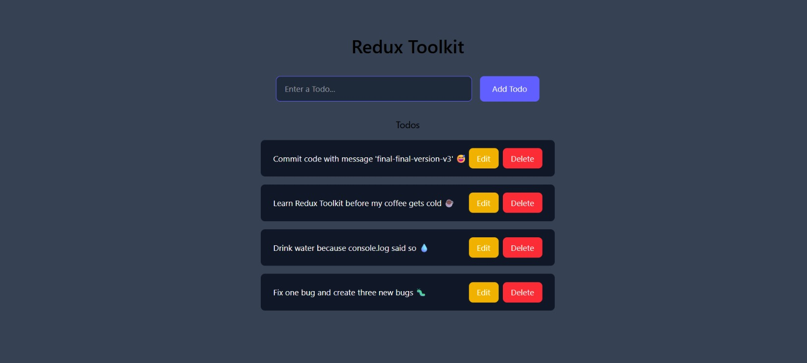

# 📝 Redux Toolkit Todo App

A modern **Todo Task Management Application** built with **React.js and Redux Toolkit** to demonstrate global state management in a clean and scalable way.

This application allows users to **add, update, and delete tasks** while maintaining a centralized state using Redux Toolkit.

---

# 📸 Application Preview



---

# 🚀 Features

✔ Add new tasks easily
✔ Update/Edit existing todos
✔ Delete completed or unwanted tasks
✔ Global state management using Redux Toolkit
✔ Clean and responsive UI using Tailwind CSS
✔ Simple and beginner-friendly project structure

---

# 🛠️ Tech Stack

### Frontend

React.js
JavaScript (ES6)
HTML5
CSS3
Tailwind CSS

### State Management

Redux Toolkit
React Redux

---

# 📂 Project Structure
```
redux-toolkit-todo-app/

├── public/

├── src/

│ ├── app/
│ │ └── store.js

│ ├── components/
│ │ ├── AddTodo.jsx
│ │ └── Todos.jsx

│ ├── features/
│ │ └── todo/
│ │ └── todoSlice.js

│ ├── App.jsx
│ ├── App.css
│ ├── index.css
│ └── main.jsx

├── Redux.png
├── package.json
└── README.md
```
---

# ⚙️ Application Workflow

User Opens Application
↓
User Enters Todo Task
↓
Redux Toolkit Dispatches Action
↓
Global State Updates in Store
↓
Todo List UI Re-renders Automatically

---

# 🎯 Key Learning Highlights

React Functional Components
React Hooks (useState)
Redux Toolkit Slice Creation
Global State Management
Dispatching Redux Actions
Using useSelector and useDispatch
Component-Based Architecture

---

# 💡 Why I Built This Project

I created this project to strengthen my understanding of **Redux Toolkit and React state management**.

This project helped me learn:

• Managing global state using Redux Toolkit
• Creating reducers and actions using createSlice
• Connecting React components with Redux Store
• Building scalable React applications

---

# ⚙️ Setup Instructions

### 1️⃣ Clone Repository
```
git clone https://github.com/Pinkuu108/redux-toolkit-todo-app.git
```
### 2️⃣ Install Dependencies
```
npm install
```
### 3️⃣ Run Application
```
npm run dev
```
Application will run at:
```
http://localhost:5173
```
---

# 👨‍💻 Author

**Pinkuna Prusty**
Java Developer | React Learner

🔗 LinkedIn
https://www.linkedin.com/in/pinkuna-prusty-55b487273/

📧 Email
[pinkunaprusty108@gmail.com](mailto:pinkunaprusty108@gmail.com)
